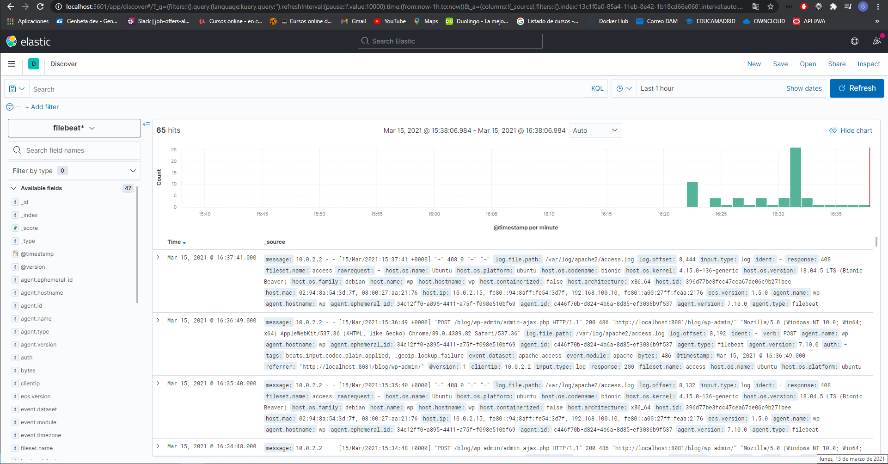

# PRÁCTICA FINAL SysAdmin

Práctica del Bootcamp DevOps III de Keepcoding.

## REQUISITOS

- VirtualBox.

- Vagrant.

## APROVISIONAR LA INFRAESTRUCTURA

Para aprovisionar la infraestructura, abrimos un shell dentro de nuestro proyecto, y ejecutamos el comando:

```vagrant up```

## WORDPRESS

Una vez ejecutado el comando anterior, abrimos nuestro navegador e introducimos:

```http://localhost:8081/blog```

Esto nos llevará a la página de configuración de Wordpress.

Introducimos los datos de configuración e instalamos la aplicación.

## KIBANA

Después de instalar WordPress, de nuevo en el navegador, introducimos:

```http://localhost:5601```

Una vez dentro, debemos crear un index pattern introduciendo:

```filebeat*```

En Configure settings añadiremos:

```@timestamp```

Una vez hecho esto, si accedemos al apartado discover de Kibana, podremos ver los logs de nuestra aplicación.

